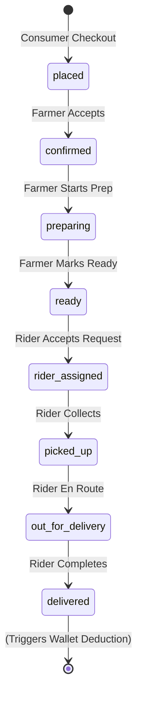

# Order Lifecycle

## State Machine
The core entity tying the marketplace together is the Order. It flows through the following states strictly:

## Transition Permissions

| Current State      | Next State         | Action Trigger            | Required Role |
|--------------------|--------------------|---------------------------|---------------|
| `None`             | `placed`           | Place Order               | CONSUMER      |
| `placed`           | `confirmed`        | Accept Order              | FARMER        |
| `confirmed`        | `preparing`        | Start Preparing           | FARMER        |
| `preparing`        | `ready`            | Mark Ready (Ping Rider)   | FARMER        |
| `ready`            | `rider_assigned`   | Accept Pickup             | RIDER         |
| `rider_assigned`   | `picked_up`        | Confirm Pickup            | RIDER         |
| `picked_up`        | `out_for_delivery` | Start Delivery            | RIDER         |
| `out_for_delivery` | `delivered`        | Confirm Delivery          | RIDER         |

## Database Impact on Delivery
When state becomes `delivered`:
1. Order is marked closed.
2. 2% Platform Fee logic is triggered (WalletSystem).
